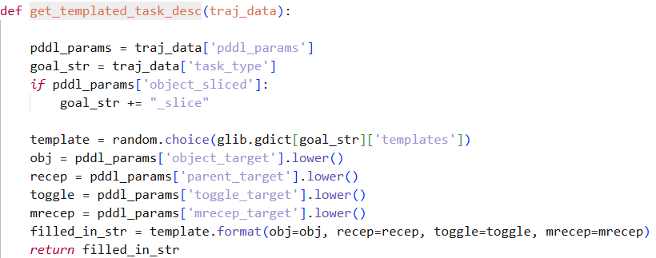

# LLM智能体报告

**报告人：王钰博 日期：2026-09-04 模型：Qwen2.5-7B 测试平台：ALFWorld 0.4.2(alfworld_3prompts.json中的合法动作put...on已被替换为move...to)**  
**[github链接]()**

## Q&A
### Q：` --max-model-len ` 和显存占用是什么关系？为什么调大了会 OOM？
### A：*max-model-len控制的是模型能处理的最大context长度，vllm服务上，context越长，占用的KV Cache越大，当max-model-len过大时KV Cache就可能撑爆显存导致OOM*

---
 
### Q：KV cache 占了多少显存？用 ` --gpu-memory-utilization ` 调整后可并发数怎么变？
### A：**

---

### Q：vLLM 的 continuous batching 意味着什么？后面跑 100+ 条轨迹时，串行请求和并发请求的墙钟时间差多少？先估算，再实测。
### A：*continuous batching是提高显存利用率，增大吞吐量的一种方法，将静态处理的batch改成了每处理完batch中的一个req就加入新req进来，解决了GPU一个batch内已完成req显存不释放的问题。*

---

### Q：如果用 Qwen3：它是混合思考模型，默认可能输出 <think>...</think> 段。在 ReAct 循环里这会污染动作解析。查一下怎么关。

### A：*启动的是vllm服务，因为vllm的completion API没有关闭think的相关参数，所以需要在tokenizer去设置llm对应的chat模板，保证tokenizer处理后的prompt已经关掉了think模式，具体做法就是在tokenizer.apply_chat_template()中设置enable_thinking=False即可*
---

### Q：` eval_in_distribution（seen） `和` eval_out_of_distribution（unseen） `分别是多少局？区别在哪？论文里报的通常是哪个？
### A：*eval_in_distribution全量140局（seen），eval_out_of_distribution134局（unseen）。seen集的训练场景，物体种类，外观，位置在训练时出现过；unseen集没出现过。 区别在于seen集考察同分布下模型的特定训练效果，unseen则考察模型应对未知环境的泛化能力。 在ReAct以及大部分llm论文中报的是eval_out_of_distribution*

---

### Q：ALFWorld 有 6 类任务（pick_and_place、pick_clean_then_place、pick_heat_then_place、pick_cool_then_place、look_at_obj_in_light、pick_two_obj_and_place）。它们的难度差别在哪？为什么 heat/cool 类通常更难？
### A：* pick_and_place：搜索物体->寻找目标位置->放置。难度较小 pick_clean/heat/cool_then_place：搜索->拾取物体->寻找工具->使用->寻找位置放置。难点在于物体和工具间的关系绑定 look_at_obj_in_light：寻找物体拾取->寻找light->使用light观察物体。少了放置步骤，但是light存在于房间的范围更广，搜索范围会扩大。 pick_two_obj_and_place：放置两个物体到目标位置，搜索范围达到最大，相比上述任务难度大。*

---

### Q：` info["admissible_commands"] `是环境给的合法动作列表。把它塞进 prompt 算不算作弊？主流论文用不用？

### A：我认为算作弊，模型的输出格式是否正确本身也是模型的一项重要的能力指标。如果给出action-list，那么对于LLM的训练评估就只有推理决策，这是不够全面的。 并且[*ReAct*](https://github.com/ysymyth/ReAct/blob/master/alfworld.ipynb)和[*Reflexion*](https://github.com/noahshinn/reflexion/blob/main/alfworld_runs/alfworld_trial.py)的alfworld测试中并未使用admisbile_commands。

---

### Q：观测里的` Your task is to: ... 是怎么来的？同一个 gamefile 每次 reset 任务一样吗？

### A：alfworld生成task的核心源码  先从[goal_library.py](https://github.com/alfworld/alfworld/blob/master/alfworld/gen/goal_library.py)中提取任务模板dict并随机选个模板，把traj_data提取到的任务目标传到模板中得到task。 同一个gamefile每次reset任务一样。

---

## ReAct + 2-shot 3 次random seed的结果表格（baseline）
| 任务类型 | 局数 | 成功率 | 平均步数 | 无效动作率 |
| :--- | :---: | :---: | :---: | :---: |
| pick_and_place（取物放置） | 24 | 34.72% ± 2.41% | 8.43 ± 0.30 | 89.28% ± 1.16% |
| pick_clean_then_place（清洗后放置） | 31 | 47.31% ± 7.45% | 11.14 ± 1.05 | 68.70% ± 3.60% |
| pick_heat_then_place（加热后放置） | 23 | 75.36% ± 5.02% | 10.79 ± 0.04 | 43.46% ± 5.33% |
| pick_cool_then_place（冷却后放置） | 21 | 61.90% ± 4.76% | 8.78 ± 0.44 | 62.38% ± 2.53% |
| look_at_obj（观察物体） | 18 | 7.41% ± 3.21% | 8.33 ± 4.04 | 66.96% ± 2.02% |
| pick_two_obj（取两个物体） | 17 | 35.29% ± 0.00% | 11.83 ± 0.00 | 66.72% ± 3.63% |
| **总体** | **134** | **45.27% ± 1.88%** | **10.20 ± 0.36** | **68.73% ± 0.33%** |

### 分析
   #### 从失败轨迹里随机抽取25条进行了人工检查，统计得到各类失败原因占比：

      在抽取的20条轨迹里，格式错误的轨迹有明显的共同特征：只要环境返回一次 see nothing 或  nothing happens 时，模型的action就会开始出现ouch等非法动作并陷入死循环无法输出合法动作，个人认为这是模型在环境反馈异常时的默认输出，模型在输出ouch时无法意识到是错误行为，因为在给出的alfworld_3prompts中，示例非常完美，从未出现nothing happens后的action示例，而模型本身仅根据示例无法输出正确action，导致了nothing happens后因没有相应example对照学习而陷入了死循环。

## 消融实验
消融实验部分，对照baseline做了以下4组实验（每组实验采用3个随机种子保证条件不同）：
   - 失败反馈的处理
   - admisible actions列表注入
   - few-shot 示例的数量与匹配方式
   - 强制think引导模型分析问题与act-only
### 实验一：失败反馈的处理
      方法说明：在Nothing happens后拼接提示词(the previous action had no effect, please choose another action)，Observation传给模型。
      事前假设：模型在有了提醒后会减少发出类似ouch的错误action，成功率应该提升，无效动作率下降。
**评测结果如下：**
| 任务类型 | 数量 | 成功率 | 平均步数 | 平均无效动作率 |
| :---: | :---: | :---: | :---: | :---: |
| pick_and_place | 24 | 47.2% ± 2.4% | 13.9 ± 2.6 | 58.9% ± 0.9% |
| pick_clean_then_place | 31 | 63.4% ± 1.9% | 14.3 ± 0.6 | 47.2% ± 2.9% |
| pick_heat_then_place | 23 | 73.9% ± 4.3% | 9.7 ± 0.6 | 46.9% ± 4.5% |
| pick_cool_then_place | 21 | 69.8% ± 5.5% | 11.2 ± 0.2 | 50.9% ± 2.9% |
| look_at_obj_in_light | 18 | 9.3% ± 3.2% | 21.0 ± 10.6 | 45.5% ± 5.6% |
| pick_two_obj_and_place | 17 | 17.6% ± 0.0% | 17.3 ± 0.0 | 79.6% ± 1.5% |
| **总体** | **134** | **50.2% ± 0.4%** | **12.7 ± 6.9** | **55.3% ± 1.6%** |

从结果表格对比baseline来看，总体成功率上升将近10%，无效动作率下降约10%，平均步数也小幅度减少，证明假设成立，说明模型对nothing happens的处理确实需要一定的提示来纠正错误action

---

### 实验二：admisible-commands列表注入
      方法说明：在baseline的基础上，在2-shot和Observation后拼接提示词，将每一步的合法动作动态接入prompt，提示模型从列表中选择合法action
      事前假设：模型得到合法动作列表后，输出格式被正确，无效动作率会大幅下降。
**评测结果如下：**
| 任务类型 | 数量 | 成功率 | 平均步数 | 平均无效动作率 |
| :---: | :---: | :---: | :---: | :---: |
| pick_and_place | 24 | 22.2% ± 4.8% | 12.5 ± 0.2 | 9.5% ± 0.8% |
| pick_clean_then_place | 31 | 0.0% ± 0.0% | 0.0 ± 0.0 | 15.0% ± 1.6% |
| pick_heat_then_place | 23 | 0.0% ± 0.0% | 0.0 ± 0.0 | 14.0% ± 0.7% |
| pick_cool_then_place | 21 | 6.3% ± 2.7% | 6.5 ± 0.9 | 3.3% ± 0.9% |
| look_at_obj_in_light | 18 | 13.0% ± 3.2% | 9.2 ± 3.5 | 0.0% ± 0.0% |
| pick_two_obj_and_place | 17 | 0.0% ± 0.0% | 0.0 ± 0.0 | 5.4% ± 2.9% |
| **总体** | **134** | **6.7% ± 0.7%** | **11.0 ± 6.1** | **8.9% ± 0.6%** |

从结果来看，给出admisible-commands后，无效动作率的确大幅下降了。 代价是成功率大幅下降，列表加入prompt后token开销也增大。模型真正的瓶颈是规划能力，不是信息的获取。

---
### 实验三：few-shot 示例的数量与匹配方式
      方法说明：将baseline的2-shot，改为zero-shot，2 random shot, all kind of shot，观察示例的多少与种类对模型的影响。实验目的是为了验证任务shot的数量与匹配度对模型的影响。
      事前假设：
      - zero-shot上，模型没有了示例学习，成功率大幅下降，无效动作率上升。
      - 2-rand-shot，模型在执行特定相关任务时少了一个相关shot，多了一个无关shot，可能 对模型action的输出有负面影响，预测成功率会下降。
      - all-shot，模型得到每类任务的一个shot，虽然shot很多，但是任务类型匹配的只有一个，不匹配shot会影响任务执行；在相关shot减少一个且上下文过长的情况下，我认为模型的成功率会降低，无效动作率会上升。
**评测结果如下：**

 - zero-shot   

| 任务类型 | 数量 | 成功率 | 平均步数 | 无效动作率 |    
| :---: | :---: | :---: | :---: | :---: |   
| pick_and_place | 24 | 11.1% ± 2.4% | 13.1 ± 2.2 | 84.5% ± 1.2% | 
| pick_clean_then_place | 31 | 1.1% ± 1.9% | 9.0 ± 0.0 | 97.9% ± 0.5% | 
| pick_heat_then_place | 23 | 0.0% ± 0.0% | 0.0 ± 0.0 | 85.1% ± 4.1% |  
| pick_cool_then_place | 21 | 0.0% ± 0.0% | 0.0 ± 0.0 | 73.9% ± 1.7% |  
| look_at_obj_in_light | 18 | 0.0% ± 0.0% | 0.0 ± 0.0 | 82.0% ± 1.3% |  
| pick_two_obj_and_place | 17 | 0.0% ± 0.0% | 0.0 ± 0.0 | 95.3% ± 0.2% |   
| **总体** | **134** | **2.2% ± 0.7%** | **12.9 ± 7.0** | **87.1% ± 1.4%** |

从表格来看，结果支持原假设，**zero-shot**的模型对于游戏任务基本无法正确执行，无效动作率接近**90%**，得出模型在没有示例模板的情况下，action的输出格式很难纠正。

 - 2-rand-shot

 | 任务类型 | 局数 | 成功率 | 平均步数（成功局） | 无效动作率 |
| :---: | :---: | :---: | :---: | :---: |
| pick_and_place | 24 | 33.3% ± 4.2% | 6.5 ± 1.3 | 69.1% ± 11.6% |
| pick_clean_then_place | 31 | 32.3% ± 3.2% | 10.8 ± 0.6 | 69.5% ± 4.7% |
| pick_heat_then_place | 23 | 37.7% ± 5.0% | 11.4 ± 1.1 | 62.1% ± 8.8% |
| pick_cool_then_place | 21 | 25.4% ± 9.9% | 10.7 ± 1.8 | 69.4% ± 10.2% |
| look_at_obj_in_light | 18 | 3.7% ± 3.2% | 12.0 ± 4.2 | 66.5% ± 9.6% |
| pick_two_obj_and_place | 17 | 11.8% ± 5.9% | 13.3 ± 2.9 | 64.6% ± 9.7% |
| **总计** | **134** | **25.9% ± 0.4%** | **10.2 ± 4.5** | **67.2% ± 0.9%** |

与原假设相符合，成功率下降约**15%**，平均步数与无效动作率无太大变化，可以看出shot类型的改变只影响了模型的任务学习，并未影响输出格式。

 - all-shot

| 任务类型 | 局数 | 成功率 | 平均步数（成功局） | 无效动作率 |
| :---: | :---: | :---: | :---: | :---: |
| pick_and_place | 24 | 33.3% ± 4.2% | 16.2 ± 0.2 | 36.1% ± 5.2% |
| pick_clean_then_place | 31 | 32.3% ± 3.2% | 16.4 ± 0.4 | 65.2% ± 0.9% |
| pick_heat_then_place | 23 | 37.7% ± 5.0% | 20.4 ± 0.5 | 82.7% ± 2.4% |
| pick_cool_then_place | 21 | 25.4% ± 9.9% | 9.0 ± 0.0 | 86.0% ± 2.9% |
| look_at_obj_in_light | 18 | 3.7% ± 3.2% | 0.0 ± 0.0 | 64.1% ± 0.0% |
| pick_two_obj_and_place | 17 | 11.8% ± 5.9% | 0.0 ± 0.0 | 92.0% ± 1.0% |
| **总计** | **134** | **23.9% ± 0.7%** | **16.3 ± 9.2** | **72.7% ± 0.9%** |

从结果表来看，6种shot都有的情况下模型的能力比**2-rand-shot**成功率还要第一点，说明对模型能力提升起作用的大概率只有对应任务的shot，不匹配的shot只会干扰模型对示例的学习。

---

### 实验四：强制think引导模型分析问题与act-only
      方法说明：强制think是在模型出现无效动作导致Nothing happens时末尾添加"think:"以此来引导模型进行对当前环境的思考续写，让模型每个step都能think来提高对action更准确地选择与输出；act-only则相反，使用了alfworld_3prompts的act_put类shot，给模型的示例中消除think步骤，驱使模型只做action而不会输出think。
      事前假设：
      - think让模型能在step级做出实时分析，预测会提升成功率，平均步数减少，无效动作率小幅度下降。
      - act-only在没有了语言推理的历史后，对于当前环境的理解能力下降，预测成功率会降低。

**评测结果如下：**

 - 强制think

| 任务类型 | 局数 | 成功率 | 平均步数（成功局） | 无效动作率 |
| :---: | :---: | :---: | :---: | :---: |
| pick_and_place | 24 | 51.4% ± 2.4% | 8.8 ± 0.2 | 26.1% ± 0.4% |
| pick_clean_then_place | 31 | 52.7% ± 4.9% | 14.1 ± 0.9 | 16.3% ± 2.1% |
| pick_heat_then_place | 23 | 72.5% ± 2.5% | 10.2 ± 0.6 | 21.9% ± 0.2% |
| pick_cool_then_place | 21 | 63.5% ± 5.5% | 9.8 ± 1.1 | 21.2% ± 3.4% |
| look_at_obj_in_light | 18 | 27.8% ± 5.6% | 12.6 ± 0.5 | 20.6% ± 3.8% |
| pick_two_obj_and_place | 17 | 15.7% ± 3.4% | 24.4 ± 2.4 | 34.9% ± 0.4% |
| **总计** | **134** | **49.5% ± 1.1%** | **11.6 ± 5.7** | **23.5% ± 1.0%** |

统计数据表明，强制think后模型的成功率明显提高约**10%**，无效动作率也明显下降，甚至接近**admisible-commands**，这一现象说明了think对于模型的行为规划以及错误纠正都有极大影响。

 - act-only

| 任务类型 | 局数 | 成功率 | 平均步数（成功局） | 无效动作率 |
| :---: | :---: | :---: | :---: | :---: |
| pick_and_place | 24 | 34.72% ± 2.41% | 16.0 ± 0.7 | 89.28% ± 1.16% |
| pick_clean_then_place | 31 | 47.31% ± 7.45% | 15.5 ± 0.7 | 68.70% ± 3.6% |
| pick_heat_then_place | 23 | 75.36% ± 5.02% | 20.45 ± 1.95 | 43.46% ± 5.34% |
| pick_cool_then_place | 21 | 42.9% ± 0.0% | 7.2 ± 0.0 | 62.38% ± 2.53% |
| look_at_obj_in_light | 18 | 24.1% ± 3.2% | 9.5 ± 0.7 | 66.96% ± 2.02% |
| pick_two_obj_and_place | 17 | 2.0% ± 3.4% | 46.0 | 66.72% ± 3.63% |
| **总计** | **134** | **45.27% ± 1.88%** | **13.6 ± 9.1** | **68.73% ± 0.33%** |

在去除模型的think阶段后，模型的成功率有所下降，影响较为显著的是无效动作率的上升，说明think对于action格式的输出有一定影响，而模型能保证成功率不会大幅下降的原因大概是2个匹配任务类型的shot提升了模型的任务能力。

---

## 实验对比
| 实验 | 成功率 | 平均步数（成功局） | 无效动作率 | 平均 prompt token |
| :---: | :---: | :---: | :---: | :---: |
| **baseline** | 45.27% ± 1.88% | **10.2 ± 0.36** | 68.73% ± 0.33% | 1909 |
| **add_warn** | **50.2% ± 0.4%** | 12.7 ± 6.9 | 55.3% ± 1.6% | 2180 |
| **add_think** | 49.5% ± 1.1% | 11.6 ± 5.7 | **23.5% ± 1.0%** | 2103 |
| **act-only** | 36.3% ± 1.1% | 13.6 ± 9.1 | 72.9% ± 0.8% | 1517 |
| **admissible_commands** | 26.1% ± 0.8% | 10.5 ± 3.1 | 41.3% ± 0.6% | 2415 |
| **2-rand-shot** | 25.9% ± 0.4% | 10.2 ± 4.5 | 67.2% ± 0.9% | 1925 |
| **6-shot** | 23.9% ± 0.7% | 16.3 ± 9.2 | 72.7% ± 0.9% | 4535 |
| **zero-shot** | 2.2% ± 0.7% | 12.9 ± 7.0 | 87.1% ± 1.4% | 626 |

## 开放思考

### 1. ALFWorld 这类文本环境，和真实的 GUI/工具调用场景相比，缺了什么？测出来的能力能迁移多少？
*ALFWorld与真实的GUI场景相比，缺少了更精细的空间理解和动作理解，对于位置定位在alfworld中是没有实现的工具调用上alfworld提供的动作少且固定，不具备工具的泛化能力，我认为最重要的是ALFWorld中的action缺少。 例如：当游戏提示已看到桌子上，action可以无视主体与桌子的距离而直接操作桌面，这是文本描述的很大缺陷，提供的信息不能更好的利用模型的常识。所以我认为文本迁移能到具身世界的就是根据环境来think的能力，但是对于action仍然缺乏真实性。*

### 2. 成功率这一个指标够吗？如果要评价"探索效率"或者"策略质量"，你会怎么设计指标？

*我认为成功率只能说明模型是否完成任务，并不能说明对任务完成的是否更完美高效。 探索效率：我认为成功对局的平均步数已经可以作为探索效率的指标。 策略质量：根据我个人碰到的问题。*

### 3. prompt 优化的收益边界在哪？什么时候应该停止调 prompt，转去做数据和训练？

*我认为优化的收益边界就是模型的输出格式是否正确，任务目标是否清楚，有少量示例后是否有利于模型对任务的学习。 当模型的实际问题来在模型的常识不足，对action的语义理解不够的时候，应该转去做训练，补充模型的基础知识。*

### 4. 如果给你 1000 条这个模型跑出来的轨迹（有成功有失败），你会怎么用它们来提升模型？

*我认为可以设置一个奖励评判标准： 成功轨迹：对于成功轨迹，平均步数越少奖励越高*